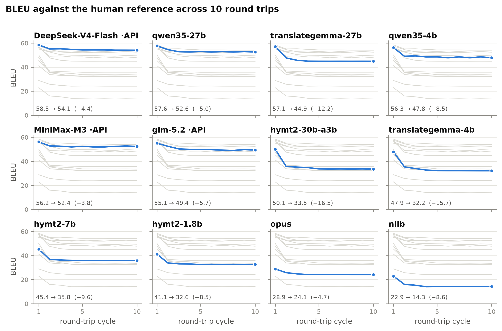
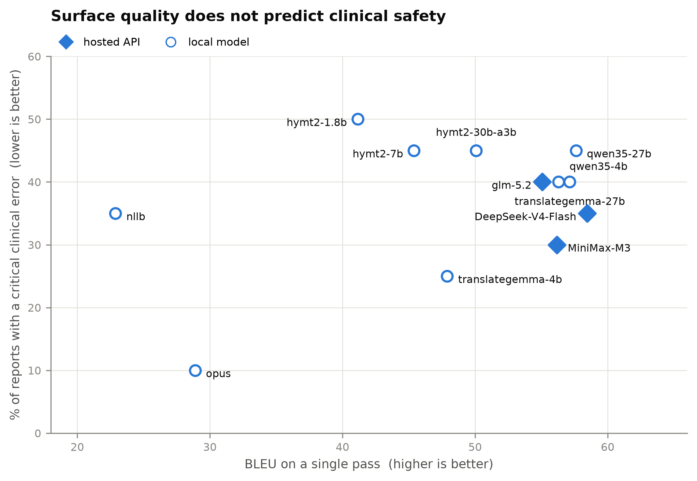

# medmt-eval

A reproducible medical machine-translation evaluation pipeline. It deliberately
reports **two layers side by side**:

1. **Surface quality** — sacreBLEU, chrF++, TER against a human reference.
2. **Clinical information loss** — negation, laterality, number/measurement and
   terminology preservation.

The point is to make the divergence visible: a fluent translation can score well
on surface metrics and still invert a negation or drop a measurement. In this
project's own results that divergence is real, and it survives every way of
looking at it: on German radiology reports the best-BLEU system
(`translategemma-27b`, BLEU 55.02) ranks fifth of twelve on clinical errors, and
under round-trip translation two systems that are indistinguishable on a single
pass differ by a factor of 2.4 in how much they lose.

**Start with [`thesis/00-overview.md`](thesis/00-overview.md).**

## Layout

```
src/medmt_eval/        the package
├── data/                  corpus converters (HimL SGML, EMEA TMX, PARROT JSONL)
├── models/                translation adapters, one per model family
├── taxonomy/clinical.py   the clinical-loss detectors
├── metrics/               surface (sacreBLEU) and optional neural (COMET)
├── stats/                 paired bootstrap, McNemar
└── report/                leaderboard aggregation and plots

scripts/               SLURM jobs, grouped by corpus — see scripts/README.md
data/derived/          converted corpora (gitignored, regenerate with `convert`)
datasets/              raw downloads (gitignored)
results/               run outputs (gitignored)
figures/               publication PNGs (scripts/make_figures.py)
thesis/                the write-up — start at thesis/00-overview.md
tests/                 141 tests, no GPU or network needed
```

## Install

```bash
module load python/3.12-base          # on the HPC cluster
python3 -m venv .venv
. .venv/bin/activate
pip install -e '.[mt,storage,plot,deepl,dev]'
pytest -q
```

## Current results — PARROT German radiology reports (DE→EN)

Full corpus, 296 reports, scored per document. `crit%` is the share of reports
containing at least one **critical** clinical finding (negation flip, laterality
error, or number/measurement mismatch); terminology findings are `major` and do
not count toward it.

| System | Type | crit% ↓ | BLEU ↑ | chrF++ ↑ | TER ↓ |
|---|---|---|---|---|---|
| `glm-5.2` | cloud | 19.26 | 51.34 | 73.42 | 34.80 |
| `DeepSeek-V4-Flash` | cloud | 19.93 | 53.75 | 74.70 | 33.26 |
| `MiniMax-M3` | cloud | 21.28 | 53.49 | 74.80 | 33.46 |
| `translategemma-4b` | local | 22.97 | 44.68 | 68.04 | 45.20 |
| `translategemma-27b` | local | 23.65 | 55.02 | 75.80 | 34.94 |
| `hymt2-7b` | local | 24.32 | 45.99 | 69.17 | 42.83 |
| `qwen35-4b` | local | 24.66 | 47.95 | 69.02 | 40.89 |
| `hymt2-1.8b` | local | 25.34 | 39.11 | 64.17 | 49.05 |
| `opus` | local | 26.69 | 24.62 | 49.05 | 61.40 |
| `qwen35-27b` | local | 28.38 | 51.74 | 70.41 | 38.20 |
| `hymt2-30b-a3b` | local | 31.08 | 47.71 | 71.16 | 41.78 |
| `nllb` | local | 33.45 | 21.76 | 46.59 | 64.96 |
| `identity` *(control)* | — | *95.95* | *3.25* | *25.63* | *94.25* |

All twelve systems now have complete results — the earlier truncation problems
affecting `nllb`, `qwen35-27b` and `translategemma-27b` are fixed (four separate
causes: generation ceiling, encoder limit, decoder limit, input ceiling).

**Surface quality and clinical safety do not agree.** `translategemma-27b` has
the best BLEU (55.02) and chrF++ (75.80) of any system and ranks fifth of twelve
on clinical errors. `glm-5.2` has the lowest critical-error rate at 19.26% while
scoring 3.7 BLEU lower. Ranking by BLEU misorders the systems on the axis that
matters clinically — the central motivation for the two-layer design.

**Scale does not help.** In every family the smaller model is safer:
`hymt2-7b` (24.32%) beats `hymt2-30b-a3b` (31.08%), `translategemma-4b` (22.97%)
beats `translategemma-27b` (23.65%), and `qwen35-4b` (24.66%) beats
`qwen35-27b` (28.38%).

**A low error rate is not the same as a good translation.** The detectors check
whether specific facts survive, not whether the output reads well. `opus`
illustrates the gap: it scores 24.62 BLEU — barely above the `nllb` floor — and
its output *shrinks* relative to the source, which suppresses detector findings
without making it safer.

## Round-trip degradation — 10 cycles, 20 passes

All thirteen entries, DE→EN→DE for ten cycles on a 20-report stratified sample.
English outputs scored against the human English reference, German outputs
against the original German; both anchors fixed, so cycle 1 is the ordinary
single-pass evaluation.



Three findings:

1. **Degradation is front-loaded.** 77% of all BLEU lost across ten round trips
   is lost in the first one; the text then reaches a fixed point rather than
   decaying without bound. True for all twelve systems regardless of size.
2. **Round-trip stability is an independent axis.** `translategemma-27b` and
   `qwen35-27b` are indistinguishable on one pass (57.1 vs 57.6) and differ by a
   factor of 2.4 in round-trip loss (−12.25 vs −5.03).
3. **The hosted APIs lead on clinical safety**, taking the three most stable
   positions and the two lowest genuine error rates (30%).



Full tables, all five figures and interpretation: **[`thesis/05-results.md`](thesis/05-results.md)**.

## Documentation

| Document | Contents |
|---|---|
| **[`thesis/`](thesis/)** | The write-up — dataset, models, methods, experiments, results |
| [`thesis/06-metrics.md`](thesis/06-metrics.md) | **Every metric: how it is computed, how to read it, why it is here** |
| [`thesis/07-metric-roadmap.md`](thesis/07-metric-roadmap.md) | COMET, XCOMET/MetricX, LLM-as-judge, MQM — assessed and prioritised |
| [`RESULTS_INFORMATION_LOSS.md`](RESULTS_INFORMATION_LOSS.md) | Original detailed results write-up |
| [`TRANSLATION_EXAMPLES.md`](TRANSLATION_EXAMPLES.md) | 126 side-by-side translations |
| [`figures/`](figures/) | Publication PNGs, regenerate with `scripts/make_figures.py` |

## Corpora

| Corpus | Direction | Segments | Register | Reference provenance |
|---|---|---|---|---|
| HimL 2015/2017 | EN→DE | 472 | Patient-facing | WMT Biomedical, human-translated |
| EMEA (sampled) | DE→EN | 400 | Drug leaflets | Official EMA translations |
| PARROT German | DE→EN | 296 | **Radiology reports** | Contributor-supplied — provenance undocumented |
| PARROT Turkish | TR→EN | 48 | **Radiology reports** | As above; **reduced detector coverage, first run invalid** |

The Turkish subset is small (48 reports from 2 contributors, versus 296 from 10
for German), ~3.5× longer per report, and covers only CT/XA/US. Its clinical
detectors are also reduced to the number check alone, since the cue lexicons
cover EN and DE only. Treat it as a separate experiment, not a language
comparison.

Convert them into the normalised schema:

```bash
medmt-eval convert himl   --input datasets/himl-test-2015.tgz --year 2015 \
                          --output data/derived/himl2015.jsonl --src-lang en --tgt-lang de
medmt-eval convert emea   --input datasets/emea-de-en.tmx.gz \
                          --output data/derived/emea.jsonl --src-lang de --tgt-lang en
medmt-eval convert parrot --input PARROT_v1.0/data/PARROT_v1_0.jsonl \
                          --output data/derived/parrot_de.jsonl --src-lang de --tgt-lang en
```

## Input schema

```json
{"id":"ct-001","domain":"radiology-ct","src_lang":"en","tgt_lang":"de",
 "src_text":"No pleural effusion.","ref_text":"Kein Pleuraerguss."}
```

`source_text`/`target_text` and `source`/`reference` are accepted aliases; CSV,
TSV and Parquet use the same field names. `ref_text` is optional — without it
the clinical detectors still run, only the surface metrics are skipped.

## Usage

```bash
# translate + score in one step
medmt-eval run --input data/derived/parrot_de.jsonl \
  --model hymt2 --model-id tencent/Hy-MT2-7B --device cuda \
  --output results/out.jsonl --term-bank data/term_banks/radiology_en_de_starter.csv

# score translations you already have (in a `hyp_text` field)
medmt-eval evaluate --input predictions.jsonl --output results/eval.jsonl

# leaderboard across several systems
medmt-eval leaderboard --input results/combined.jsonl --output-dir results/leaderboard

# is system B better than A, or is it noise?
medmt-eval compare --baseline a.jsonl --candidate b.jsonl --metric chrf --resamples 2000
```

For cluster runs see **[`scripts/README.md`](scripts/README.md)**.

## Models

| Adapter | Covers |
|---|---|
| `opus` | Helsinki-NLP Marian, direction-specific checkpoints |
| `nllb` | NLLB-200 |
| `hymt2` | Tencent Hy-MT2 1.8B / 7B / 30B-A3B |
| `translategemma` | Google TranslateGemma 4B / 27B (gated) |
| `prompted-llm` | any local causal LM (Qwen3.5, Llama, …) |
| `openai-compat` | any hosted `/v1/chat/completions` endpoint |
| `deepl` | DeepL API |
| `identity` | no-op baseline; a floor for the detectors, not a system |
| `madlad` | **broken** — produces degenerate output, excluded from results |

Check each upstream licence before use; several are non-commercial.

## Limitations

**The detectors are lexical heuristics, not clinical ground truth.** A finding is
a review candidate; its absence is not proof of safety. Known false positives
are quantified in the results document — for example ~38 % of number findings
fire only because *extra* numbers appeared, not because one was lost.

**Truncated output looks like bad translation.** Several models silently stopped
generating part-way through long reports, producing error rates of 88–97 % on
those documents that measured the cut-off rather than translation quality. Three
separate causes were involved, each needing a different fix:

* the CLI default of 512 output tokens, too low for a whole report
  (`MAX_NEW_TOKENS`, now 2048);
* encoder position limits — Opus 512, NLLB 1024 — which truncate the *input* no
  matter how large the output ceiling is (`CHUNK_MAX_TOKENS`, which splits on
  sentence boundaries and reassembles before scoring);
* decoder position limits, where generating past the table raises an
  `IndexError` in Marian that surfaces on GPU as an opaque CUDA device-side
  assert (`MODEL_MAX_NEW_TOKENS`, per model);
* an *input* ceiling — `--max-input-tokens`, default 512 — which the adapters
  pass to the tokenizer as `truncation=True`, cutting the source before the
  prompt is even built (`MAX_INPUT_TOKENS`, now 4096). The symptom is
  distinctive: the model translates only the tail of the fragment it received,
  so the output is a mid-word continuation of the *source* language rather than
  a translation. `qwen35-27b` returned six characters for a 2,998-character
  report this way.

Always check the hypothesis-to-source length ratio before trusting a score. A
ratio well below 1.0 on long documents means truncation, not poor translation.

**Detector coverage is language-dependent.** Cue lexicons exist for EN and DE
only. A TR→EN run therefore scores with the number check alone, so its numbers
are not comparable to the German ones. `ClinicalSafetyEvaluator.detector_coverage()`
reports what actually ran for a given pair.

**No clinician has validated any of this.** Establishing that these automatic
labels track expert judgement is the necessary next step before any safety claim.

**Hosted-API results are not reproducible** the way local ones are: model
versions are undisclosed and the gateway has been observed silently substituting
models. The adapter records what actually served each request and aborts on a
mismatch.

Do not train on WMT biomedical test material, and do not present
synthetic-reference metrics as deployment performance.
