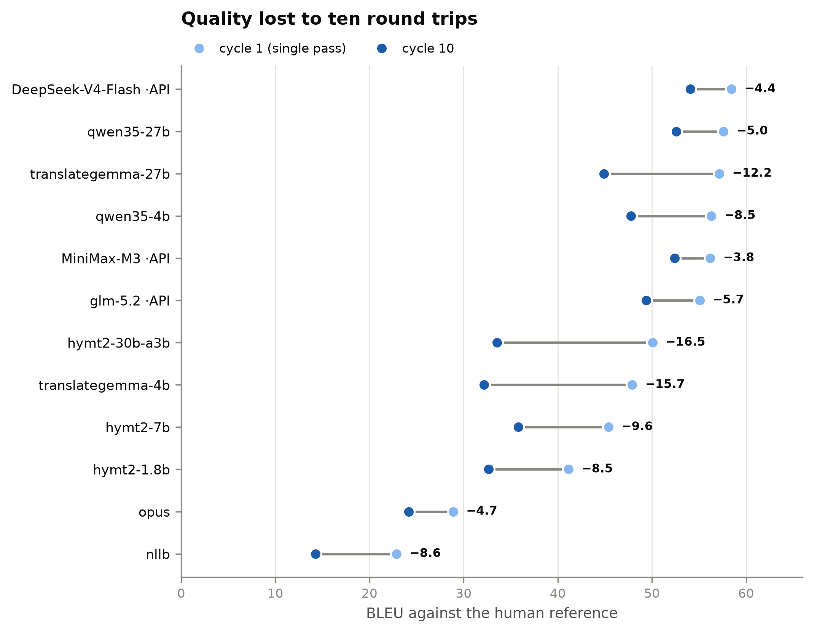
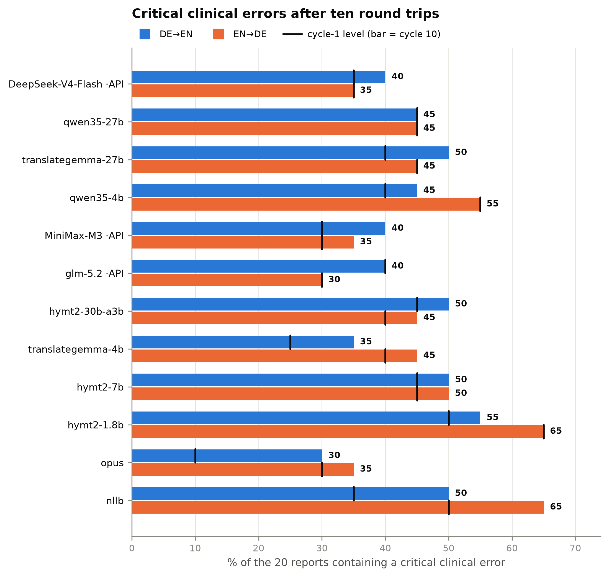
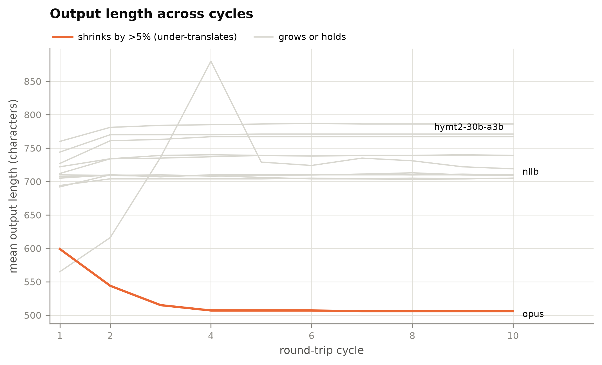

# Results

All numbers below are generated from
[`results/roundtrip_20260814_132452/roundtrip_steps.csv`](../results/roundtrip_20260814_132452/roundtrip_steps.csv)
by [`scripts/make_figures.py`](../scripts/make_figures.py) and the collection script —
none are transcribed by hand.

☁ marks hosted API systems. `c1` = cycle 1 = the ordinary single-pass benchmark.

## Master table

| System | BLEU c1 | BLEU c2 | BLEU c10 | Δ | chrF++ c1 | chrF++ c10 | crit% DE→EN | crit% EN→DE |
|---|---|---|---|---|---|---|---|---|
| `DeepSeek-V4-Flash` ☁ | 58.45 | 55.14 | 54.07 | −4.38 | 77.80 | 74.89 | 35 → 40 | 35 → 35 |
| `qwen35-27b` | 57.61 | 54.53 | 52.58 | −5.03 | 77.96 | 74.55 | 45 → 45 | 45 → 45 |
| `translategemma-27b` | 57.14 | 47.64 | 44.89 | −12.25 | 77.93 | 70.84 | 40 → 50 | 45 → 45 |
| `qwen35-4b` | 56.30 | 49.04 | 47.77 | −8.53 | 75.82 | 70.90 | 40 → 45 | 55 → 55 |
| `MiniMax-M3` ☁ | 56.17 | 52.81 | 52.41 | −3.76 | 75.82 | 74.18 | **30** → 40 | **30** → 35 |
| `glm-5.2` ☁ | 55.07 | 52.50 | 49.40 | −5.67 | 75.39 | 72.55 | 40 → 40 | **30** → **30** |
| `hymt2-30b-a3b` | 50.08 | 35.75 | 33.54 | −16.54 | 72.90 | 63.30 | 45 → 50 | 40 → 45 |
| `translategemma-4b` | 47.90 | 35.40 | 32.18 | −15.72 | 69.53 | 59.24 | 25 → 35 | 40 → 45 |
| `hymt2-7b` | 45.39 | 36.79 | 35.79 | −9.60 | 69.65 | 62.71 | 45 → 50 | 45 → 50 |
| `hymt2-1.8b` | 41.15 | 33.84 | 32.65 | −8.50 | 65.39 | 59.81 | 50 → 55 | 65 → 65 |
| `opus` | 28.88 | 25.77 | 24.15 | −4.73 | 54.69 | 49.12 | 10 → 30 | 30 → 35 |
| `nllb` | 22.88 | 16.04 | 14.27 | −8.61 | 50.31 | 38.56 | 35 → 50 | 50 → 65 |
| `identity` *(control)* | 3.39 | 3.39 | 3.39 | 0.00 | 25.33 | 25.33 | 95 → 95 | 0 → 0 |

With n=20 the critical-error rate moves in 5-point steps; **single-step differences are
not interpretable**.

---

## Finding 1 — surface quality does not predict clinical safety

If BLEU predicted safety the points would lie on a downward line. They do not.

- `qwen35-27b` beats `MiniMax-M3` by 1.4 BLEU and damages **45%** of reports against
  MiniMax's **30%**. Ranked by BLEU you pick the less safe system.
- `translategemma-4b` scores 47.9 BLEU — nearly ten points below `qwen35-27b` — and has
  the lowest genuine single-pass error rate in the set at 25%.
- The three highest-BLEU systems span 35–45% critical errors, a spread as wide as the
  whole rest of the table.

The mechanism is visible in a single constructed example
([06-metrics.md](06-metrics.md) §0): dropping the word "No" from "No pleural effusion"
costs only 15 BLEU points, while an entirely harmless paraphrase costs 47. The metric is
working exactly as designed; the design is wrong for this question.

## Finding 2 — degradation is front-loaded and converges

The shape is the same in all twelve panels: a cliff between cycle 1 and cycle 2, then a
plateau. Averaged over the systems, **77% of all BLEU lost across ten round trips is
lost in the first one**. By cycle 5 most systems have stopped changing entirely —
`hymt2-7b` is bit-identical from cycle 7 onward.

Translation converges to a fixed point rather than decaying without bound. The
practical implication is that round-trip degradation is a *property measurable in one
cycle*; ten cycles were needed to establish that, but not to use it.

Critical errors behave the same way. Five of twelve systems gain ≤5 points across all
ten cycles, and the two that move most (`opus` +20, `nllb` +15) are the two weakest
translators. The level, not the slope, is the story.

## Finding 3 — round-trip stability is an independent axis

| System | Δ BLEU over 10 cycles | front-loaded share |
|---|---|---|
| `MiniMax-M3` ☁ | −3.76 | 89% |
| `DeepSeek-V4-Flash` ☁ | −4.38 | 76% |
| `opus` | −4.73 | 66% |
| `qwen35-27b` | −5.03 | 61% |
| `glm-5.2` ☁ | −5.67 | 45% |
| `hymt2-1.8b` | −8.50 | 86% |
| `qwen35-4b` | −8.53 | 85% |
| `nllb` | −8.61 | 79% |
| `hymt2-7b` | −9.60 | 90% |
| `translategemma-27b` | −12.25 | 78% |
| `translategemma-4b` | −15.72 | 80% |
| `hymt2-30b-a3b` | −16.54 | 87% |

`translategemma-27b` and `qwen35-27b` are indistinguishable on a single pass — 57.1 vs
57.6, well inside noise — and differ by a factor of 2.4 in round-trip loss. A benchmark
that reports only single-pass BLEU calls these two systems equivalent. They are not.

`hymt2-30b-a3b` is the sharpest case: third-best single-pass score, worst stability in
the set, finishing below the 1.8 B model of its own family.

Note that `opus` appears stable only because it has little left to lose — see Finding 5.

## Finding 4 — the hosted APIs lead on clinical safety

The three hosted models take the three most stable positions on round-trip loss, and
`MiniMax-M3` and `glm-5.2` post the lowest genuine critical-error rates among
high-quality systems (30%). `glm-5.2` is the only system whose EN→DE rate does not move
at all across ten cycles (30 → 30).

This is a finding about *capability*, not deployability. Sending German radiology
reports to a third-party API is a data-protection decision, not a benchmark result, and
nothing here should be read as recommending it.

## Finding 5 — under-translation flatters the safety metric

`opus` posts the lowest single-pass critical-error rate in the set (10%). It is also the
only system whose output *shrinks* — 599 → 506 characters, −16% — while every other
system's grows or holds.

A detector cannot flag a measurement that was never emitted. `opus`'s low score is
substantially an artefact of producing less text, which is consistent with its
second-from-bottom BLEU. **Figure 3 must not be read without figure 5.**

This is a general hazard for any source-vs-output safety metric, and it is one of the
reasons the metric roadmap ([07-metric-roadmap.md](07-metric-roadmap.md)) prioritises an
open-class recall instrument.

---

## Answering the question

**Does German↔English medical translation need a specialised model?**

On the current evidence, **the case for fine-tuning is not yet made — but the case for
better evaluation is overwhelming.**

Three things point that way.

1. **The best available systems already score well on surface metrics.** 58 BLEU on
   radiology reports is good. A fine-tune would be chasing a few points on a metric
   already shown not to track the thing that matters.
2. **Every system fails clinically, at a rate no fine-tune plausibly closes.** The best
   genuine single-pass critical-error rate among high-quality systems is 30% of reports.
   That is not a gap a domain adapter closes; it is a different problem.
3. **The measurement is not yet trustworthy enough to detect success.** The detectors
   have known false positives (~38% on numbers), unmeasured false negatives (the
   `BWK 12` → `L12` miss), and a documented bias toward rewarding under-translation.
   Fine-tuning against an instrument with these properties risks optimising the
   instrument rather than the translation.

The honest next step is the metric work in
[07-metric-roadmap.md](07-metric-roadmap.md) — a learned semantic metric, an open-class
error finder, and a small human-MQM validation set — and only then a decision about
model building. Steps 1–3 of that roadmap need no new translations and no new
annotation; all thirteen systems' outputs are already on disk.

## Threats to validity

- **n=20 for the round-trip.** Resolution is 5 points on the error rate. Single-step
  differences mean nothing.
- **One corpus.** Findings 1–5 are established on PARROT-DE radiology reports. They may
  not transfer to patient-facing or regulatory text, where the single-pass benchmark
  used three other corpora.
- **Fictional reports.** PARROT reports are radiologist-authored but not real patient
  data, and may be cleaner than production dictation.
- **Detector precision and recall** — quantified where possible, unbounded where not.
  See [06-metrics.md](06-metrics.md) §2.3.
- **No human validation yet.** Nothing in this chapter has been checked by a clinician.
  That is the single largest gap.
