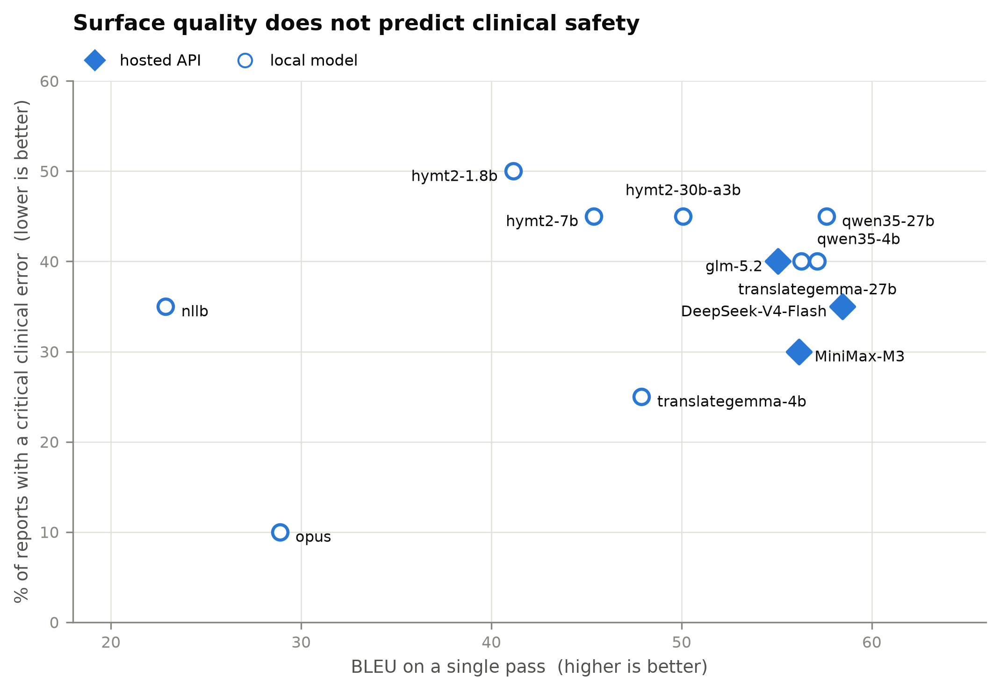
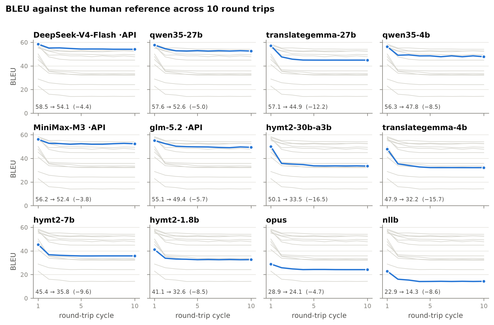
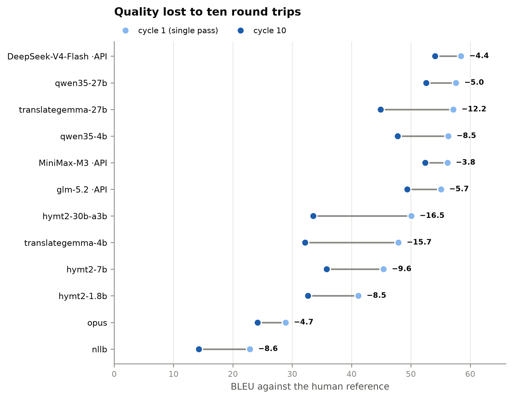
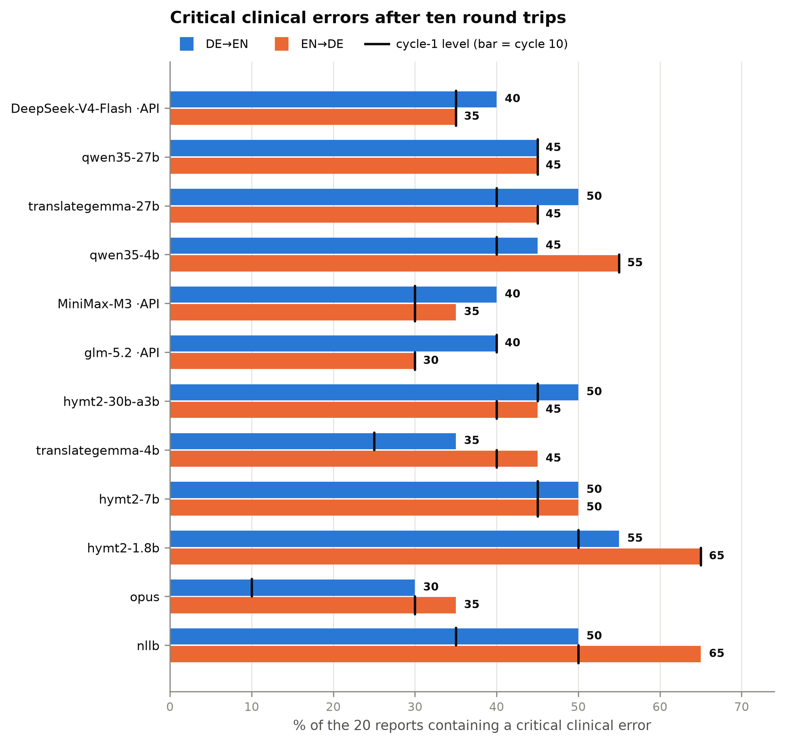
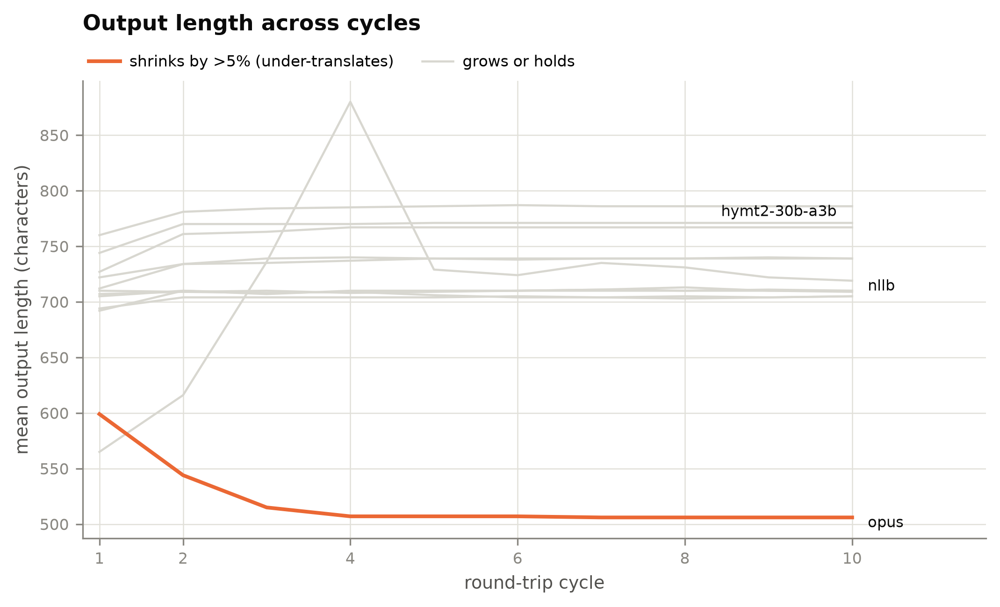

# Results

All numbers below are generated from
[`results/roundtrip_20260814_132452/roundtrip_steps.csv`](../results/roundtrip_20260814_132452/roundtrip_steps.csv)
by [`scripts/make_figures.py`](../scripts/make_figures.py) and the collection script —
none are transcribed by hand.

☁ marks hosted API systems. `c1` = cycle 1 = the ordinary single-pass benchmark.

## Master table

| System | BLEU c1 | BLEU c2 | BLEU c10 | Δ | chrF++ c1 | chrF++ c10 | crit% DE→EN | crit% EN→DE |
|---|---|---|---|---|---|---|---|---|
| `DeepSeek-V4-Flash` ☁ | 58.45 | 55.14 | 54.07 | −4.38 | 77.80 | 74.89 | 35 → 40 | 35 → 35 |
| `qwen35-27b` | 57.61 | 54.53 | 52.58 | −5.03 | 77.96 | 74.55 | 45 → 45 | 45 → 45 |
| `translategemma-27b` | 57.14 | 47.64 | 44.89 | −12.25 | 77.93 | 70.84 | 40 → 50 | 45 → 45 |
| `qwen35-4b` | 56.30 | 49.04 | 47.77 | −8.53 | 75.82 | 70.90 | 40 → 45 | 55 → 55 |
| `MiniMax-M3` ☁ | 56.17 | 52.81 | 52.41 | −3.76 | 75.82 | 74.18 | **30** → 40 | **30** → 35 |
| `glm-5.2` ☁ | 55.07 | 52.50 | 49.40 | −5.67 | 75.39 | 72.55 | 40 → 40 | **30** → **30** |
| `deepl` ☁ | 52.73 | 45.97 | 41.95 | −10.78 | 72.93 | 67.34 | 30 → 45 | 35 → 45 |
| `hymt2-30b-a3b` | 50.08 | 35.75 | 33.54 | −16.54 | 72.90 | 63.30 | 45 → 50 | 40 → 45 |
| `translategemma-4b` | 47.90 | 35.40 | 32.18 | −15.72 | 69.53 | 59.24 | 25 → 35 | 40 → 45 |
| `hymt2-7b` | 45.39 | 36.79 | 35.79 | −9.60 | 69.65 | 62.71 | 45 → 50 | 45 → 50 |
| `hymt2-1.8b` | 41.15 | 33.84 | 32.65 | −8.50 | 65.39 | 59.81 | 50 → 55 | 65 → 65 |
| `opus` | 28.88 | 25.77 | 24.15 | −4.73 | 54.69 | 49.12 | 10 → 30 | 30 → 35 |
| `nllb` | 22.88 | 16.04 | 14.27 | −8.61 | 50.31 | 38.56 | 35 → 50 | 50 → 65 |
| `identity` *(control)* | 3.39 | 3.39 | 3.39 | 0.00 | 25.33 | 25.33 | 95 → 95 | 0 → 0 |

With n=20 the critical-error rate moves in 5-point steps; **single-step differences are
not interpretable**.

---

## Finding 1 — surface quality does not predict clinical safety

If BLEU predicted safety the points would lie on a downward line. They do not.

- `qwen35-27b` beats `MiniMax-M3` by 1.4 BLEU and damages **45%** of reports against
  MiniMax's **30%**. Ranked by BLEU you pick the less safe system.
- `translategemma-4b` scores 47.9 BLEU — nearly ten points below `qwen35-27b` — and has
  the lowest genuine single-pass error rate in the set at 25%.
- The three highest-BLEU systems span 35–45% critical errors, a spread as wide as the
  whole rest of the table.

The mechanism is visible in a single constructed example
([06-metrics.md](06-metrics.md) §0): dropping the word "No" from "No pleural effusion"
costs only 15 BLEU points, while an entirely harmless paraphrase costs 47. The metric is
working exactly as designed; the design is wrong for this question.

**This is not an artefact of n-gram matching.** COMET — a learned metric trained
on human adequacy judgements, which does not penalise paraphrase — produces a
*third* ordering, agreeing with neither BLEU nor the clinical layer, and ranks
`hymt2-30b-a3b` first while that system sits second-worst of eleven on clinical
errors. Full table in [07-metric-roadmap.md](07-metric-roadmap.md).

## Finding 2 — degradation is front-loaded and converges

The shape is the same in all twelve panels: a cliff between cycle 1 and cycle 2, then a
plateau. (The figure was generated before DeepL was run and shows twelve systems; DeepL
is in the tables.) Averaged over those twelve, **77% of all BLEU lost across ten round
trips is lost in the first one**; with DeepL it is 76%. By cycle 5 most systems have stopped changing entirely —
`hymt2-7b` is bit-identical from cycle 7 onward.

Translation converges to a fixed point rather than decaying without bound. The
practical implication is that round-trip degradation is a *property measurable in one
cycle*; ten cycles were needed to establish that, but not to use it.

Critical errors behave the same way. Seven of the twelve systems in the figure gain ≤5
points on DE→EN across all ten cycles (an earlier draft said five; it does not
reproduce from the data), and the systems that move most (`opus` +20, `nllb` +15,
DeepL +15) are mostly the weakest translators. The level, not the slope, is the story.

**DeepL is the one exception to "converges" in degree.** It loses 10.8 BLEU over ten
cycles, and only 63% of that in the first; it loses **4.0 more after cycle 2**, the most
of any system (next: `translategemma-4b`, 3.2). It does flatten (42.2, 41.8, 41.9 over
the last three cycles), so "fixed point" still holds, but it is reached late.

## Finding 3 — round-trip stability is an independent axis

| System | Δ BLEU over 10 cycles | front-loaded share |
|---|---|---|
| `MiniMax-M3` ☁ | −3.76 | 89% |
| `DeepSeek-V4-Flash` ☁ | −4.38 | 76% |
| `opus` | −4.73 | 66% |
| `qwen35-27b` | −5.03 | 61% |
| `glm-5.2` ☁ | −5.67 | 45% |
| `hymt2-1.8b` | −8.50 | 86% |
| `qwen35-4b` | −8.53 | 85% |
| `nllb` | −8.61 | 79% |
| `hymt2-7b` | −9.60 | 90% |
| `deepl` ☁ | −10.78 | 63% |
| `translategemma-27b` | −12.25 | 78% |
| `translategemma-4b` | −15.72 | 80% |
| `hymt2-30b-a3b` | −16.54 | 87% |

`translategemma-27b` and `qwen35-27b` are indistinguishable on a single pass — 57.1 vs
57.6, well inside noise — and differ by a factor of 2.4 in round-trip loss. A benchmark
that reports only single-pass BLEU calls these two systems equivalent. They are not.

`hymt2-30b-a3b` is the sharpest case: third-best single-pass score, worst stability in
the set, finishing below the 1.8 B model of its own family.

Note that `opus` appears stable only because it has little left to lose — see Finding 5.

## Finding 4 — the hosted APIs lead on clinical safety

The three hosted models take the three most stable positions on round-trip loss, and
`MiniMax-M3` and `glm-5.2` post the lowest genuine critical-error rates among
high-quality systems (30%). `glm-5.2` is the only system whose EN→DE rate does not move
at all across ten cycles (30 → 30).

This is a finding about *capability*, not deployability. Sending German radiology
reports to a third-party API is a data-protection decision, not a benchmark result, and
nothing here should be read as recommending it.

## Finding 5 — under-translation flatters the safety metric

`opus` posts the lowest single-pass critical-error rate in the set (10%). It is also the
only system whose output *shrinks* — 599 → 506 characters, −16% — while every other
system's grows or holds.

A detector cannot flag a measurement that was never emitted. `opus`'s low score is
substantially an artefact of producing less text, which is consistent with its
second-from-bottom BLEU. **Figure 3 must not be read without figure 5.**

This is a general hazard for any source-vs-output safety metric, and it is one of the
reasons the metric roadmap ([07-metric-roadmap.md](07-metric-roadmap.md)) prioritises an
open-class recall instrument.

---

## Finding 6 — DeepL is competitive on the words and unstable under repetition

The commercial baseline, added 2026-09-29 and run on the free API plan
([02-models.md](02-models.md#deepl)). All 296 reports, scored with **one** detector
version across all thirteen systems (see [04-experiments.md](04-experiments.md) for why
that matters). **words%** is the share of documents with a critical *negation* or
*laterality* finding; number and measurement findings, which are two thirds of all
critical findings on this corpus, are shown separately and excluded from it.

| System | words% | numbers% | all-crit% | term% | BLEU | chrF++ | TER |
|---|---|---|---|---|---|---|---|
| `DeepSeek-V4-Flash` ☁ | 4.1 | 17.2 | 19.9 | 1.4 | 53.7 | 74.7 | 33.3 |
| `glm-5.2` ☁ | 4.7 | 15.9 | 19.3 | 1.4 | 51.3 | 73.4 | 34.8 |
| `MiniMax-M3` ☁ | 6.1 | 16.6 | 21.3 | 1.7 | 53.5 | 74.8 | 33.5 |
| `translategemma-4b` | 6.1 | 17.9 | 23.0 | 2.7 | 44.7 | 68.0 | 45.2 |
| `translategemma-27b` | 6.4 | 18.9 | 23.6 | 1.4 | 55.0 | 75.8 | 34.9 |
| **`deepl`** ☁ | **6.8** | 20.6 | 25.7 | 2.0 | 52.7 | 73.8 | 36.2 |
| `hymt2-1.8b` | 7.4 | 19.6 | 25.3 | 2.0 | 39.1 | 64.2 | 49.0 |
| `hymt2-7b` | 8.1 | 18.6 | 24.3 | 2.7 | 46.0 | 69.2 | 42.8 |
| `hymt2-30b-a3b` | 9.8 | 25.7 | 31.1 | 3.0 | 47.7 | 71.2 | 41.8 |
| `qwen35-4b` | 11.8 | 20.3 | 24.7 | 7.4 | 48.0 | 69.0 | 40.9 |
| `qwen35-27b` | 13.9 | 24.0 | 28.4 | 8.1 | 51.7 | 70.4 | 38.2 |
| `nllb` | 19.9 | 25.3 | 33.4 | 17.9 | 21.8 | 46.6 | 65.0 |
| `opus` | 20.6 | 18.2 | 26.7 | 12.2 | 24.6 | 49.0 | 61.4 |

DeepL is **sixth of thirteen on the words** and fourth on BLEU (per-document mean).
Ranked by all-crit it drops to ninth, because its number-finding rate is the fifth
highest; that is only partly a typographic artefact (below), which is why the words-only
column exists.

- **The words-only ranking differs from the standard one, and in a useful direction.**
  `opus` looks middling on all-crit (26.7%) but is the *worst* system on the words
  (20.6%). It emits fewer numbers, so it has fewer to get wrong — the under-translation
  bias of Finding 5, visible from the other side.
- **DeepL is unremarkable on laterality and negation.** Laterality: 5.7% of documents,
  tied with `MiniMax-M3`, better than the seven weakest systems. Negation: 1.4%
  (four documents) against 0.3% (one) for the three hosted LLMs. At this sample size that
  is not a difference.
- **Terminology is not a DeepL strength.** After the detector-version correction its
  2.0% sits in the ordinary 1.4–3.0% band of the good systems.
- **Round trip: the weakness.** −10.78 BLEU over ten cycles against −3.8 to −5.7 for the
  best hosted LLMs, and the slowest to settle (Finding 2). Its critical rate goes
  30% → 45% DE→EN, which at n = 20 is three documents.
- **It has no COMET score**, nor does `translategemma-27b`; the COMET run predates both.

**The `5-mm` artefact, measured.** DeepL writes a hyphenated unit for compound
modifiers ("a 5-mm nodule"), and the number detector's measurement pattern requires
whitespace between value and unit, so it reads the hyphenated form as a mismatch
against the source's `5 mm` — the same code it gives a genuine `15 mm` error.
Normalising the hyphen and re-scoring: DeepL emits it in **5 of 296 reports**, and
doing so clears **2** critical documents (25.68% → 25.00%). `hymt2-30b-a3b` is the only
other system affected (−0.34 points). The effect is real but small; it was described
as "probably inflated" before being measured, which overstated it. The detector
was **not** changed, because altering the shared instrument would revalue the whole
benchmark.

**What this does to the founding question.** The strongest commercial baseline lands in
the middle of the field on the words, well behind the leading hosted LLMs, and is less
stable than any of them under repetition. That neither answers "does it need a
specialised model" nor supports "commercial MT is enough". It does mean the ~1-in-5
document-level failure rate is not a property of open models: it is what the best
available systems, commercial or not, produce on this corpus.

## Answering the question

**Does German↔English medical translation need a specialised model?**

On the current evidence, **the case for fine-tuning is not yet made — but the case for
better evaluation is overwhelming.**

Three things point that way.

1. **The best available systems already score well on surface metrics.** 58 BLEU on
   radiology reports is good. A fine-tune would be chasing a few points on a metric
   already shown not to track the thing that matters.
2. **Every system fails clinically, at a rate no fine-tune plausibly closes.** The best
   genuine single-pass critical-error rate among high-quality systems is 30% of reports.
   That is not a gap a domain adapter closes; it is a different problem.
3. **The measurement is not yet trustworthy enough to detect success.** The detectors
   have known false positives (~38% on numbers), unmeasured false negatives (the
   `BWK 12` → `L12` miss), and a documented bias toward rewarding under-translation.
   Fine-tuning against an instrument with these properties risks optimising the
   instrument rather than the translation.
4. **Three interventions that should have helped did not.** Injecting a
   dictionary, injecting a 16× larger dictionary, and running a three-model
   debate each moved the clinical error rate by zero or made it worse
   ([09-experiments-glossary-debate.md](09-experiments-glossary-debate.md)).
   Since every one of those is cheaper than fine-tuning and none of them worked,
   there is no reason to expect the expensive intervention to succeed where they
   failed — *unless* the reason they failed is that the instrument cannot see
   their effect, which is exactly what needs establishing first.

The failures also point somewhere specific. Across both experiments the surviving
critical findings are overwhelmingly **numbers and measurements** — every one of
the debate's eight failures, and 12 of 14 in the dictionary baseline. Terminology
interventions cannot reach that category by construction. If a targeted fix
exists, it is constrained decoding or a numeric post-check, not a glossary and not
a committee.

The honest next step is the metric work in
[07-metric-roadmap.md](07-metric-roadmap.md) — a learned semantic metric, an open-class
error finder, and a small human-MQM validation set — and only then a decision about
model building. Steps 1–3 of that roadmap need no new translations and no new
annotation; all fourteen systems' outputs are already on disk.

## Threats to validity

- **n=20 for the round-trip.** Resolution is 5 points on the error rate. Single-step
  differences mean nothing.
- **One corpus.** Findings 1–5 are established on PARROT-DE radiology reports. They may
  not transfer to patient-facing or regulatory text, where the single-pass benchmark
  used three other corpora.
- **Fictional reports.** PARROT reports are radiologist-authored but not real patient
  data, and may be cleaner than production dictation.
- **Detector precision and recall** — quantified where possible, unbounded where not.
  See [06-metrics.md](06-metrics.md) §2.3.
- **DeepL is a single dated run on an unversioned service.** No model id is exposed, so
  it cannot be re-run to the same result later, and it was run once.
- **Score sets from different dates are not comparable.** The terminology detector
  changed after the July runs; see [04-experiments.md](04-experiments.md). The published
  critical rates are unaffected, but any terminology figure from the stored leaderboard
  is stale.
- **No human validation yet.** Nothing in this chapter has been checked by a clinician.
  That is the single largest gap.
